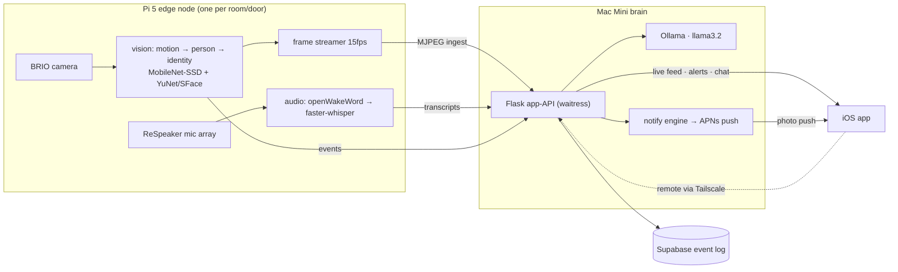

# Leofric

**A local-first, multi-node home security system — Raspberry Pi edge nodes, an
LLM brain on a Mac Mini, and a native iOS app. Everything runs on hardware you
own; nothing leaves your network.**

> **On the name:** the repo, the system, and the iOS app all go by **Leofric**
> (an Anglo-Saxon earl — a watchful lord of the house). The LLM identifies
> itself as Leofric when asked. The spoken wake word is currently "hey Jarvis"
> (a stock openWakeWord model); training a custom "hey Leofric" model is a
> documented TODO. Everywhere else, Leofric is the name.

## What it does

A Pi 5 with a camera and mic array watches a room and listens for its wake
word. It detects motion, finds people, and recognizes *which* person —
distinguishing the household from strangers — entirely on-device. Spoken
questions are transcribed locally and answered by a llama on a Mac Mini on the
LAN. A SwiftUI iPhone app shows a live 15fps camera feed (at home or remotely
over Tailscale), an alert timeline with snapshots, and chat threads with the
brain — and receives rich push notifications (photo attached) when someone
unknown shows up.

No cloud cameras, no subscription, no footage leaving the house. Privacy is a
design feature, not a setting.

## Status: complete through Phase 2, deliberately shelved

Phases 1–2 are **done and were verified live**: the node ran 24/7 under
systemd (surviving reboots, with hardware watchdog and persistent journald
after a real power-rail incident), and the app worked on a physical iPhone —
live feed, alerts, chats, and remote access over Tailscale from another state.

The project is currently **shelved for a practical, physical reason, not a
technical one**: it was built in a condo whose layout offers no sensible
mounting point or power at the one location worth securing. A multi-node
security system needs a property with multiple points worth watching — doors,
a driveway, a yard, a shop. The architecture was always designed for that
house; the condo was the lab. Development pauses here until the hardware has
somewhere real to live, and this repo is written to be picked back up years
from now on fresh hardware: see **[docs/RESURRECTION.md](docs/RESURRECTION.md)**.

## What it scales to

The system is multi-node today, not aspirationally: nodes self-identify
(`NODE_ID`/`NODE_ROLE`), the brain tracks them independently (per-node frames,
events, online status), and the app already has a node picker. Scaling to a
real property is: flash another Pi, clone, set two env vars, done. The
Phase 3+ roadmap (`docs/ROADMAP.md`) covers smart/debounced alerting, clip
capture on unknown persons, expanded identity enrollment, sound anomaly
detection, and H.264 streaming for smoother cellular viewing.

## Engineering highlights

- **Everything local on constrained hardware.** Person detection, face
  identification, wake word, and speech-to-text all run on a Pi 5 under
  Python 3.13 — which meant replacing four spec'd libraries that had no
  cp313/aarch64 story (dlib → YuNet/SFace, Porcupine → openWakeWord,
  whisper → faster-whisper, HOG → MobileNet-SSD). Reasoning in
  [docs/DECISIONS.md](docs/DECISIONS.md).
- **The 4fps → 15fps live-feed investigation.** A "just raise the fps" config
  change surfaced three stacked, *measured* bottlenecks: Werkzeug 3 silently
  dropped keep-alive support (~50ms of TCP handshake + mDNS per frame — fixed
  with waitress), `requests` overhead inflating ~50× under GIL contention
  with the inference threads (fixed with stdlib `http.client` over one
  persistent connection), and macOS timer coalescing stretching a background
  LaunchAgent's 66ms sleeps to ~150ms (fixed by making the feed event-driven
  via a condition variable). Full war story in
  [docs/superpowers/specs/2026-07-23-live-feed-smoothness-design.md](docs/superpowers/specs/2026-07-23-live-feed-smoothness-design.md).
  Result: 14.9fps delivered, 67ms median frame gap, local and over Tailscale.
- **A zero-dependency iOS app.** SwiftUI, XcodeGen, no third-party packages —
  including a hand-rolled MJPEG stream reader (AVPlayer can't play MJPEG, and
  iOS strips the multipart framing, so frames are parsed by JPEG SOI/EOI
  markers) with auto-reconnect, capped backoff, and honest on-screen failure
  reasons. Rich push via a Notification Service Extension that attaches the
  event snapshot.
- **Hardened by real incidents.** A PMIC latch-off (power loss) led to
  persistent journald, the Pi's hardware watchdog, an EEPROM update, and
  active cooling. A remote outage (Tailscale silently stopped) led to the
  app's reconnect/status UI and the feed's stale-stream cutoff — the server
  ends a stream rather than re-broadcast a frozen frame that looks live.
- **Boring, debuggable choices everywhere else**: systemd, Flask, Supabase
  for the durable event log, one HTTP surface between every component.

## Repo map

| Path | What |
|---|---|
| `main.py`, `config.py` | Pi node entry point + all tunables (env-overridable) |
| `vision/` | camera, motion, person, identity, frame streamer |
| `audio/` | mic, wake word, transcription |
| `brain/` | HTTP client to the Mac + conversation/session memory |
| `storage/` | Supabase event logging |
| `macmini/` | the brain: Flask app-API, notify engine, APNs sender + tests |
| `ios/LeofricApp/` | SwiftUI app + notification extension + tests (XcodeGen) |
| `deploy/` | systemd unit for the node |
| `scripts/` | model fetcher, hardware checks |
| `docs/` | spec, roadmap, ADRs, runbooks — start with RESURRECTION.md |
| `tests/` | Pi-side unit tests |

## Reviving or reproducing this

**[docs/RESURRECTION.md](docs/RESURRECTION.md)** is the complete
pick-it-back-up runbook: what to back up before decommissioning hardware, how
to provision a fresh Pi (or several) from nothing, how to stand the Mac brain
back up, and how to rebuild the app. It assumes you remember nothing.
